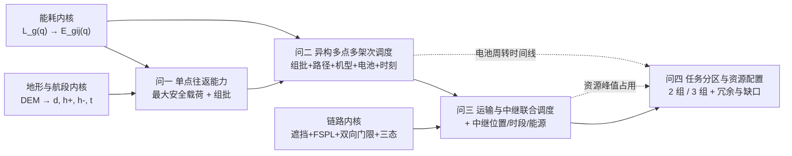

# 建模思路报告 · 2026 D题 山区洪涝灾害下无人机运输与通信协同优化

> 题型族：D 题族（地理 + 资源排布 + 系统级协同）｜命题方：未标注（非华为题）｜赛程：四天
> 依据材料：`山区洪涝灾害下无人机运输与通信协同优化.docx`、`分析/cpgmcm-2026-D-题意翻译.md`、`数据/` 全部附件、`结果提交模板.xlsx`

## 0 一句话内核

以统一的三段飞行能耗与链路预算为物理内核，把「货箱组批 → 异构多机调度 → 空地联合调度 → 资源分区」串成一条逐层加约束、逐层复用的运筹主线。

## 1 题型族判定与候选模型池

| 判定依据 | 结论 |
|---|---|
| 题干反复出现「组批」「访问顺序」「架次开始时刻」「资源不得跨组调配」「共享电池与能源组件周转」，决策变量为整数指派 + 连续时刻 | 属**组合优化**族，而非预测或评价族 |
| 目标为「架次数 / 能耗 / 完成时间 / 及时性」多指标权衡，且明确要求「说明权衡关系」 | 属**多目标优化**，需给帕累托或加权结构，不能只给单解 |
| 出现 FSPL、地形遮挡、收发增益、双向链路门限等完整链路预算体系 | 含**通信机理**分量，需独立实现并单独验证，不能并入优化黑箱 |
| 问题采用镇龙乡真实 DEM、真实村镇与道路水系 | 属**地理/资源排布**方向，须做 DEM 空间计算与地理可视化 |

综合：主线归入「带时间窗、多资源周转的异构车队路径问题（Heterogeneous Fleet VRP with Time Windows and Resource Turnaround）」，并在其上叠加空地协同层与分区评价层。

## 2 全文主线

### 2.1 主线模型

**主线：统一「时空—能耗—链路」三元物理内核 + 分层递进的混合整数规划（MILP）/ 启发式求解框架。**

物理内核（全题唯一，四问共用，对应附件附录 2 与附录 3）包含三块：

1. **地形与航段内核**：从 30 m DEM 抽取任意航段沿途像元最高高程 → 巡航海拔 = 最高地面高程 + 50 m；O01 作业高度 = 地面海拔，服务区 = 地面海拔 + 30 m；每访问一个服务区后重新爬升。输出每条航段的 `(d_ij, h+_ij, h-_ij, t_ij)`。
2. **能耗内核**：以等效航程公式 L_g(q) = L_g0 − (L_g0 − L_gF)(q/Q_g)^{3/2} 为唯一载荷修正通道，把载荷换算为单位距离能量消耗；航段能耗 = 水平巡航能耗 + 爬升附加能耗，下降不单独计。输出 E_gij(q)。
3. **链路内核**：对任意时刻的三维端点对，依次执行「地形遮挡判定 → 双向链路门限 → FSPL + 遮挡附加损耗 → 可用性布尔化 → 三态通信状态判定」，输出 A_ijt 与通信状态时间线。

为什么它能贯穿全文：问题一求的是**内核的单点特例**；问题二求的是**内核 + 整数调度层**；问题三在问题二之上再叠加**内核第三块**；问题四只对问题三的时间线做资源归集切分，不再新建模型。四问因此共享同一套符号、单位与计算口径，自然满足题面 S59 的「口径一致」要求。

需要什么输入：节点坐标与海拔、DEM 栅格、机型参数、逐箱清单、链路参数、资源库存。全部齐备。

### 2.2 辅助模型

- **辅助模型 A：多目标处理框架**（加权和 + ε-约束，用于生成帕累托前沿前段）。因为每题都要求「说明权衡关系」，必须能产出指标间权衡曲线，单点解无法支撑该论证。
- **辅助模型 B：邻域搜索 / 大邻域搜索（LNS）启发式**。作为精确 MILP 的规模兜底：80 箱、15 区、8 机的指派变量规模不小，需要在四天内拿到高质量可行解并保证可复现。
- **辅助模型 C：通信覆盖的几何分析（视距可达域计算）**。用于给中继候选悬停位提供结构化初值，避免在连续位置空间盲搜。

### 2.3 主线贯穿示意

## 3 逐问方案对比

### 3.1 问一：单点往返最大安全载荷与货箱组批

| 候选模型 | 适用条件 | 数据要求 | 优点 | 风险 | 实现难度 | 建议 |
|---|---|---|---|---|---|---|
| 解析反解 + 二分法（对 q 求解能耗约束边界） | 约束关于 q 单调；单点往返路径固定 | 仅需机型参数与 DEM | 求解快、可解释、45 个值可逐一给出解析口径 | 若载荷与能耗非单调则二分失效；本题 L_g(q) 单调递减，**成立** | 低（约 0.5 人天） | **推荐** |
| 一维装箱 / 集合划分 MILP（对每服务区独立求解最小架次数） | 单服务区箱数少（S001 为 15 箱，其余 ≤ 10 箱） | 逐箱质量与体积 | 可证最优架次数，便于给出上下界 | 若同时优化三目标，需多轮求解 | 中（约 1 人天） | **推荐**（作为组批主模型） |
| 首次适应递减 + 局部改进启发式 | 需要快速基线 | 同上 | 秒级出解，便于作对照基线 | 不保证最优，需报告与 MILP 的 gap | 低（约 0.3 人天） | 推荐作为对照基线 |
| 三维装箱（含箱体形状堆叠） | 需要箱体三维尺寸 | 附件仅给单箱体积，**未给长宽高** | — | 数据不满足，无法实现 | — | **不推荐**（数据不足） |

关键风险具体化：T-01 中「最大安全载荷」若改用「等效航程 ≥ 往返水平距离」判据，会给出与能量判据不同的数值（能量判据还含爬升附加能耗，通常更严格）。必须在论文中明确采用能量判据，并把航程判据作为上界交叉校验。

### 3.2 问二：异构无人机多点多架次运输调度

| 候选模型 | 适用条件 | 数据要求 | 优点 | 风险 | 实现难度 | 建议 |
|---|---|---|---|---|---|---|
| 三下标 VRP 型 MILP（架次-路径-时刻）+ 电池时间线约束 | 规模小到中型；需精确解或高质量界 | 逐箱清单、机型、电池库存 | 可统一表达组批/顺序/机型/电池/时刻五类决策，与题面 S33 的七变量一一对应 | 时间索引离散化后变量数快速增长；全天 4 小时以上时段若按秒建变量不可行 | 高（约 2 人天） | **有条件推荐**（需先做时间粒度归约） |
| 两阶段分解：先「装箱 + 路径构造」，再「资源时序分配」 | 时限约束可分离处理 | 同上 | 每阶段规模可控，四天内可完成；便于中间结果复用 | 两阶段割裂可能丢失全局最优；需报告分解 gap | 中（约 1.5 人天） | **推荐** |
| 大邻域搜索（LNS）/ 自适应大邻域搜索（ALNS） | 需要快速高质量可行解 | 同上 | 可处理复杂时间窗与周转约束，适合四天周期 | 随机性需固定随机种子以保证可复现 | 中（约 1.5 人天） | **推荐**（与上者结合） |
| 纯遗传算法/模拟退火直接编码全部变量 | 目标函数可快速求值 | 同上 | 实现直观 | 约束全靠罚函数，易产出不可行解；时间窗惩罚权重难标定 | 中 | 不推荐作为主模型（可作对比） |

关键风险具体化：S32 的「充电周转」是问题二的核心增量。若忽略「充至 100% 才能复用」与两阶段分段充电（S73），会出现同一块电池在物理上不可能的时间内完成两架次，从而使 makespan 被显著低估。必须把电池做成显式时间线资源并逐块校验互斥。

### 3.3 问三：通信约束下的运输与中继联合调度

| 候选模型 | 适用条件 | 数据要求 | 优点 | 风险 | 实现难度 | 建议 |
|---|---|---|---|---|---|---|
| 链路可行性判定 + 通信约束嵌入调度（约束式方法） | 通信状态可由几何位置确定性判定 | 链路参数 + DEM | 严格符合附录 3 口径，约束可解释，结论可复现 | 逐时刻三维判定计算量大，需做矢量化和缓存 | 高（约 2 人天） | **推荐** |
| 中继位置连续优化（覆盖最大化 / 最小化中继数） | 悬停位为连续变量 | 同上 | 能给出真正的最优悬停位，符合 S44 的连续决策 | 覆盖函数非凸，易陷入局部；需给初值策略 | 高（约 1.5 人天） | **推荐**（与辅助模型 C 配合） |
| 中继候选点离散化（在 DEM 网格上枚举） | 计算资源有限 | 同上 | 实现简单，可并行；四天内稳 | 若网格过粗会高估中继需求，需做网格粒度敏感性 | 中（约 1 人天） | **推荐作为主实现路径** |
| 多跳中继网络 | — | — | — | 题面 S83 明确「不允许中继无人机之间进行多跳转发」，**违反题意** | — | **不推荐**（不合题意） |

关键风险具体化：若只对巡航段做链路判定（漏掉爬升、下降与投送阶段），通信中断会被系统性漏检，中继架次数量偏少、方案不可执行。必须按 S41 的四阶段全时段判定，并给时间粒度（T-06）的敏感性结果。

### 3.4 问四：任务分区与资源配置

| 候选模型 | 适用条件 | 数据要求 | 优点 | 风险 | 实现难度 | 建议 |
|---|---|---|---|---|---|---|
| 基于问题三时间线的资源峰值归集（切分而非重优化） | 分区须保持问题三方案不变（S52） | 问题三输出台账 | 完全符合 S52，计算量小，可复现 | 依赖问题三输出的完整度（逐时刻资源占用） | 低（约 0.5 人天） | **推荐** |
| 图划分 / 社区发现（按服务区空间邻近与架次共现构边） | 需在 S51、S53 约束下产生 2/3 组 | 服务区坐标 + 架次-服务区关联 | 可生成符合约束的分区，便于做均衡比较 | 若同架次跨区会被硬约束合并，可能削弱均衡性 | 中（约 0.8 人天） | **推荐**（作分区生成器） |
| 分区 + 重优化的联合模型 | 允许改变问题三方案 | — | 理论上可给出更优配置 | 直接违反 S52「保持不变」 | — | **不推荐**（不合题意） |
| 四维度评价（规模/冗余/均衡/缺口）加权评价 | 需要客观赋权 | 问题三输出与库存表 | 结构清晰，结论可直接回答 S55 | 权重若主观需说明来源 | 低（约 0.5 人天） | **推荐** |

关键风险具体化：S54 要求「资源需求」为各组**独立执行**所需，即组内峰值占用而非总量平均。若用平均分摊，2 组与 3 组的资源需求都会被低估，缺口结论会失真。必须按组内时间线求峰值。

## 4 选型结论与理由

- **采纳：统一物理内核（航段 + 能耗 + 链路）**。理由：题目在附录 2、附录 3 给出了唯一计算口径，四问都必须复用；任何自创的简化公式都会与「以附件给定值为准」（S20）冲突。
- **采纳：问一用解析/二分反解 + 单服务区集合划分 MILP，辅以贪心基线**。理由：单点往返路径固定、载荷—能耗关系单调，解析路径成立；同时给贪心基线可量化 gap，满足「验证路线独立」的要求。
- **采纳：问二用两阶段分解 + LNS**。理由：若直接对全场时间轴建 MILP，时间离散粒度必须粗到丢失电池周转精度；分解后每阶段规模可控，四天内可完成并复现。
- **采纳：问三用「离散候选悬停位 + 逐时刻链路判定」**。理由：离散化便于在四天内算完并做粒度敏感性；连续优化作为对照给出上界。
- **淘汰：多跳中继网络**。理由：S83 明确禁止，条件不满足（非「太简单」）。
- **淘汰：三维装箱模型**。理由：附件只给单箱体积，未给箱体尺寸，数据不满足。
- **淘汰：分区 + 重优化联合模型**。理由：S52 要求保持问题三方案不变，条件不满足。
- **淘汰：纯遗传算法直接编码全变量**。理由：本题硬约束密集（时限、能量、互斥、通信），罚函数法难以稳定产出可行解，不满足「四天内可复现」的要求。

## 5 验证路线

| 模型 | 验证方式 | 需要的数据/实验 | 预期结论强度 |
|---|---|---|---|
| 航段与能耗内核 | ① 与解析特例对照（单点往返、零爬升、空载时的能耗应与 v_c、L_g0 直接换算一致）；② 量纲与守恒检验（能量叠加可加性） | 附件机型参数 + DEM | 强：可给出数值级对照误差 |
| 最大安全载荷 | 用「等效航程 ≥ 往返水平距离」判据独立复算，与能量判据结果对比 | 机型参数、DEM 航段距离 | 中强：给出两判据差异区间与保守性结论 |
| 问一组批 | 与贪心基线对比 gap；用下界（质量下界、体积下界、能量下界取大）验证架次数 | 逐箱清单 | 强：可报告最优性 gap |
| 问二调度 | ① 可行解独立复算（重新逐架次校验质量/体积/能量/时限/电池互斥）；② 多随机种子稳定性；③ 与「忽略周转约束」的松弛解对比，量化周转代价 | 问题二输出台账 | 强：可行性可逐条核验，代价可量化 |
| 链路内核 | ① 用自由空间特例（两端点间无地形阻挡、距离已知）对照 FSPL 手算值；② 单调性检验（距离增大可用性不应上升） | 链路参数 | 强：可给出 dB 级对照 |
| 问三中继方案 | ① 逐时刻复核通信状态时间线无中断；② 悬停点网格粒度敏感性（粗/细网格下中继架次与能耗变化） | 问题三输出 | 中强：粒度敏感性可量化 |
| 问四资源配置 | ① 用组内峰值占用独立重算，与输出配置对比；② 与库存逐机型核对生成缺口 | 问题三台账 + 库存表 | 强：核算可逐项复现 |
| 全题口径 | 跨问一致性检查（同一服务区—机型对的单点往返能耗，问一与问二/三结果必须一致） | 各问输出 | 强：直接可查 |

## 6 创新点清单

### 6.1 真创新

| 创新点 | 基线 | 改进 | 代价 |
|---|---|---|---|
| **能耗内核与链路内核解耦但共享同一时间轴**：先算运输时间线，再在同一时间轴上判通信状态 | 常见做法是把通信当作运输的独立后处理 | 通信中断可被精确归因到具体航段阶段，中继服务时段因此可直接由运输时间线导出，避免两套时间不一致 | 需维护统一时间栅格，内存与计算量增加 |
| **电池周转的显式时间线建模**（含两阶段分段充电） | 常见做法按「架次间隔 ≥ 满充时间」粗估 | 按实际结束 SOC 算充电时长，允许不同电池并行充电，释放真实周转能力 | 时间线校验复杂度上升 |
| **分区即切分而非重优化**：直接对问题三的资源时间线做峰值归集 | 常见做法是分区后重跑调度 | 完全满足 S52「保持不变」，且能在同一时间线上比较 2 组与 3 组的冗余与均衡 | 分区质量受限于问题三方案，需在结论中说明 |
| **载荷的非线性等效航程折算贯穿全题** | 常见做法按满载/空载线性插值 | 使用题目给定的 (q/Q)^{3/2} 关系，载荷—能耗关系与题面完全一致 | 组批与调度中的能耗计算需逐段按剩余载荷重算 |

### 6.2 包装创新（不建议计入创新点）

- 把加权和改名为「多目标协同优化框架」而权重来源仍是主观设定。
- 把贪心装箱包装成「启发式智能算法」而不给 gap。
- 把多次随机重启称为「鲁棒优化」而没有鲁棒性度量。
- 用「数字孪生」「决策大脑」等词描述一个 MILP 求解器。

## 7 论文结构草图

| 章节 | 内容 | 对应模型 | 预计篇幅 |
|---|---|---|---|
| 摘要 | 建模思路 / 主要方法 / 模型 / 结果与结论 / 创新点 | — | ≤2 页 |
| 一、问题重述 | 背景、数据清单、四问任务 | — | 1—1.5 页 |
| 二、问题分析 | 题型定位、主线说明、跨问依赖、各问难点 | 主线框架 | 2—3 页 |
| 三、模型假设 | 含 T-01 至 T-12 需声明的假设 | — | 1 页 |
| 四、符号说明 | 统一符号表 | — | 1 页 |
| 五、物理内核：地形—能耗—链路 | 航段提取、等效航程、三态通信判定 | 内核 | 4—6 页 |
| 六、问题一模型与求解 | 最大载荷反解、组批 MILP、三目标优化、ρ 灵敏度 | 问一模型 | 5—7 页 |
| 七、问题二模型与求解 | 两阶段分解、LNS、电池时间线、可行性检验 | 问二模型 | 6—8 页 |
| 八、问题三模型与求解 | 中继候选位、链路约束嵌入、联合调度、权衡 | 问三模型 | 6—8 页 |
| 九、问题四模型与求解 | 分区生成、资源峰值归集、四维比较、缺口 | 问四模型 | 4—5 页 |
| 十、模型检验与灵敏度 | 内核对照验证、gap、粒度敏感性、ρ 敏感性 | 全部 | 3—4 页 |
| 十一、模型评价与推广 | 优点、局限、适用条件 | — | 1—2 页 |
| 参考文献与附录 | 引用、代码清单、结果表 | — | — |

## 8 风险与备用方案

| 风险 | 触发条件 | 备用方案 |
|---|---|---|
| 问题二 MILP 在四天内无法求解到可接受 gap | 时间离散粒度细化后变量数超求解器能力 | 切换到「两阶段分解 + LNS」，MILP 只用于小规模子问题定界 |
| 链路逐时刻判定计算量过大 | 运输架次总时长 × 端点对数 × 时间步过长 | 采用「关键节点 + 分段常量」判定：只在航段阶段切换点密集采样，段内做单调性外推；并给粒度敏感性 |
| 电池周转约束过紧导致问题二无可行解 | 首批时限 3600 s 与机型航程不匹配 | 先求「时限松弛解」定位冲突源，再在论文中报告可行性边界与最小松弛量 |
| 问题三中继数量不足导致部分架次必须直连但直连不可用 | 地形遮挡严重、G01 天线高度有限 | 允许同一架次按时刻分段使用直连/中继（对应 T-07 理解 A），并报告需要的最大中继数 |
| 问题四按切分做资源归集时出现无法归属的架次 | 同一架次跨组且未合并 | 按 S53 强制并入同组，并在结论中报告该约束对均衡性的影响 |
| 巡航海拔按 DSM 取值导致过度保守 | 题面要求用 DEM 最高像元（T-10 理解 A） | 同时给出扣除地表物体的地面高程口径作为对照，量化保守度 |
| 时间口径理解偏差导致全题结果不可比 | T-04「累计作业时间」定义不一致 | 全文统一采用 makespan，并在符号表中显式定义，所有问沿用 |
