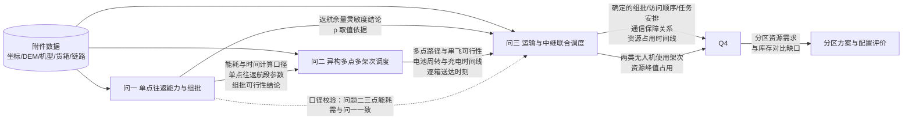

# 赛题翻译报告 · 2026 D题 山区洪涝灾害下无人机运输与通信协同优化

> 命题方：未标注（非华为题，不参评华为专项奖） ｜ 题型族：D 题族（地理+资源排布+系统级协同）；操作层面属「带时间窗与资源周转的异构车辆路径问题（VRP）+ 空地链路预算判定 + 资源配置评价」
> 数据来源：`山区洪涝灾害下无人机运输与通信协同优化.docx`（主赛题，附附录 1—3）、`数据/无人机应急物资运输基础数据/`（5 个 xlsx）、`数据/镇龙乡地理空间数据/`、`结果提交模板.xlsx`

## 0 赛题档案

| 项目 | 内容 |
|---|---|
| 届次/年份 | 第二十三届（2026 年）中国研究生数学建模竞赛 |
| 题号 | D |
| 题目全称 | 山区洪涝灾害下无人机运输与通信协同优化 |
| 命题方 | 未标注（背景引用新华社公开报道，未标注华为/中兴命题） |
| 题型族 | D 题族：地理 + 资源排布 + 系统级协同 |
| 赛程 | 四天 |
| 问题数 | 4 问（层层加约束，非并列） |
| 场景 | 广西南宁横州市镇龙乡及周边，1 个调度中心 + 15 个服务区 + 80 个不可拆货箱 |

> 说明：题目正文在「问题描述」后直接进入「四、论文与结果提交要求」，正文二、三未编号。附录 1—3 给出数据说明、时间与能源计算规则、通信链路计算与服务规则，**其口径优先级高于正文概述性表述**。

## 1 逐句解释

### 1.1 问题背景

| 句号 | 原文（截断） | 白话解释 | 要素类型 | 限定词 | 隐含条件 | 理解错的后果 |
|---|---|---|---|---|---|---|
| S01 | 山区洪涝灾害通常具有突发性强、影响范围分散以及道路、供电和通信设施同时受损等特点 | 交代灾害特征是「断路、断电、断网」并发 | 背景 | 「通常」 | 无 | 无 |
| S02 | 连续强降雨可能引发山洪、滑坡和道路塌方，使部分居民点在短时间内与外界失去稳定的地面交通联系 | 地面交通不可用是本题立题前提 | 背景 | 「可能」「短时间内」 | 车辆不是备选运输方式 | 若引入车辆运输，等于自加题目未给的自由度，跑题 |
| S03 | 灾后早期，饮用水、应急食品、医疗物资和生活卫生用品需要尽快送达 | 四类物资即附件四种物资类型，全题物资集合封闭 | 定义 | 「灾后早期」 | 物资集合 = {医疗物资, 饮用水, 应急食品, 生活卫生用品} | 遗漏某类物资，问题一至四交付量系统性偏少 |
| S04 | 传统车辆往往难以及时进入地形起伏大、道路受损严重的区域 | 再次排除车辆 | 背景 | 「往往」 | 无 | 无 |
| S05 | 无人机受地面道路条件影响较小，因而可以作为应急运输的重要补充手段 | 运输载体 = 无人机 | 定义 | 「补充手段」 | 唯一运输方式 | 无 |
| S06 | 2026 年 7 月，受台风"美莎克"带来的持续强降雨影响，广西横州市镇龙乡遭遇严重洪涝灾害 | 场景地理背景，与地理数据一致 | 背景 | 时间：2026-07 | 与 `调度中心与服务区.xlsx` 坐标一致 | 无 |
| S07 | 新华社记者在镇龙乡的现场报道显示，洪水、山体落石和道路塌方从多个方向阻断通行，核心受灾区域一度处于交通中断、通信不畅状态 | 交通中断 + 通信不畅是双重受损前提 | 背景 | 「一度」 | 通信受损 → 需要中继（问题三来源） | 若忽略通信受损前提，问题三会被误当成附加题 |
| S08 | 《新华每日电讯》的后续报道称，镇龙乡曾出现断路、断电、断网，全乡约 8000 人受困 | 给出受灾规模量级 | 背景 | 「约 8000 人」 | 与附件「本次需保障人口」合计 3342 人不在同一层级 | 若把 8000 当成求解总量，与附件人口字段冲突 |
| S09 | 救援期间，食品、饮用水和药品需要依靠徒步或空中投送进入受灾区域，大型无人机还承担了电力抢修材料的运输任务 | 现实描述，电力抢修材料**不在**本题货箱集合内 | 背景 | 「救援期间」 | 本题只运输附件给定的 80 个货箱 | 若把电力抢修材料加入货箱清单，超出附件数据，不可复现 |
| S10 | 临时通信设备和应急供电设备则被用于逐步恢复灾区联络 | 现实描述，不属本题决策对象 | 背景 | — | 本题中继手段是 R 机型无人机，不是临时通信设备 | 无 |
| S11 | 这一现实场景表明，应急物资运输和通信保障往往需要在道路受阻、能源受限和信息不完整的条件下协同组织 | 点明「协同」是全题主线关键词 | 修辞 | 「往往」 | 运输与通信必须联合建模 | 若把四问做成四道互不相关的题，违背题目主线 |
| S12 | 在实际救援过程中，完成物资投送不仅取决于无人机能否飞抵目标区域，还受到载荷、水平飞行距离、爬升与下降高度、沿线地形净空、能源储备、任务时限和设备周转等多种因素影响 | 列出影响投送的全部物理因素 | 定义 | 六项因素 | 见附录 2 | 若省略爬升/下降或地形净空，能耗与最大载荷口径不符 |
| S13 | 与此同时，运输无人机在爬升、巡航、下降及物资交接的全过程中，需要持续保持指挥、遥测和交接确认链路 | **通信连续性覆盖四个阶段**，含物资交接阶段 | 硬约束 | 「全过程」「持续」 | 通信判定须沿时间轴逐时刻做 | 只在巡航段判链路，会削弱问题三的连续通信约束 |
| S14 | 当固定通信设施受损，或山体遮挡导致地面网关无法覆盖完整任务区间时，还需要空中中继无人机在适当的位置和时段提供临时通信保障 | 中继触发条件 = 直连不可用；决策变量含位置与时段 | 定义 | 「适当的位置和时段」 | 中继位置与悬停时段是连续决策变量 | 把中继位置离散成服务区坐标，方案空间被不当缩小 |
| S15 | 因此，山区洪涝灾害下的物资投送不仅涉及无人机运输，还需要同步考虑通信保障和设备资源的协调使用 | 再次强调运输—通信联合 | 修辞 | 「同步」 | 无 | 无 |

### 1.2 标准测试场景

| 句号 | 原文（截断） | 白话解释 | 要素类型 | 限定词 | 隐含条件 | 理解错的后果 |
|---|---|---|---|---|---|---|
| S16 | 题目以镇龙乡及周边山区为地理背景，设置标准测试场景（真实场景可能略有不同） | 只需在给定测试场景下求解 | 背景 | 「标准测试场景」 | 不要求泛化到真实地形变动 | 无 |
| S17 | 附件提供 1 个临时调度中心、15 个服务区和 80 个不可拆货箱 | 规模硬数字：1 / 15 / 80 | 数据口径 | 80 个 | 逐箱清单共 80 行 | 数量对不上会导致全题交付量错误 |
| S18 | 设置三种运输无人机机型，共配置 8 架实体运输无人机 | 机型 3 种，实体 8 架 | 数据口径 | 8 架 | 问题一**不考虑**实体数量；问题二起受 8 架约束 | 问题一若引入 8 架约束，与该问「不考虑实体无人机调度」矛盾 |
| S19 | 并给出配套共享电池组、数字高程模型（DEM）数据、中继无人机、可更换能源组件及无线链路参数等信息 | 数据清单预告 | 数据口径 | — | 5 个基础数据文件 + 地理空间数据 | 漏读某附件会导致模型缺参数 |
| S20 | 空间坐标和公开地理数据用于描述测试场景，需求、时限、装备和资源参数以附件给定值为准 | **口径优先级规则** | 数据口径 | 「以附件给定值为准」 | 附件与正文冲突时以附件为准 | 若用正文的 8000 人或自算航程替代附件参数，口径不可复现 |

### 1.3 问题一

| 句号 | 原文（截断） | 白话解释 | 要素类型 | 限定词 | 隐含条件 | 理解错的后果 |
|---|---|---|---|---|---|---|
| S21 | 本问题在不考虑实体无人机和共享电池调度的情况下，研究单服务区直接往返条件下的运输能力与货箱组批问题 | 问题一**剥离**实体无人机与电池周转 | 硬约束 | 「不考虑」 | 只受机型参数 + 载荷 + 体积 + 返航余量约束 | 若在问题一引入电池共享与充电周转，与该问设定冲突 |
| S22 | 每个架次采用 O01→Si→O01 的直接往返形式，仅服务一个服务区 | 架次路径形态固定为两点往返 | 硬约束 | 「直接往返」「仅服务一个」 | 不存在多服务区串飞，不存在 O01 中转 | 若采用多点巡回，问题一答案不成立 |
| S23 | 其中 O01 表示临时调度中心，Si 表示第 i 个服务区（i=1,2,…,15） | 编号约定 | 定义 | i=1..15 | 与附件 S001..S015 对应 | 编号错位会导致服务区—货箱对应关系错 |
| S24 | 同一服务区可由多个架次分批服务，不得跨服务区组批 | 允许同一服务区多架次；**禁止**混装不同服务区货箱 | 硬约束 | 「可…不得…」 | 组批 = 单服务区货箱子集的划分 | 若允许跨区混装，问题一退化且与题意不符 |
| S25 | 根据附件给出的节点坐标、30 米 DEM、机型参数和货箱数据，完成如下各项 | 指定数据来源四项 | 数据口径 | — | 必须用 DEM 算地形净空与巡航海拔 | 若用直线距离代替地形相关计算，能耗口径错误 |
| S26 | 计算三种机型在不同服务区执行单点往返任务时的最大安全载荷 | 交付：3×15 = 45 个最大安全载荷值 | 交付要求 | 3 机型 × 15 服务区 | 需结合返航安全余量反解载荷上限 | 只给一个型号或一个服务区，交付不完整 |
| S27 | 在货箱不可拆分且每个货箱只能安排一次，并满足载质量、装载体积和返航安全能量余量等要求的条件下，确定各服务区的货箱组批方案 | 交付：组批方案，受三类约束 | 交付要求 | 「不可拆分」「只能安排一次」 | 每个货箱是原子的；约束 = 质量 + 体积 + 能量 | 漏任一条约束会导致方案不可行 |
| S28 | 在完成全部货箱交付的基础上，综合考虑往返架次数、总运输能耗和累计作业时间，对组批方案进行优化，并说明各指标之间的权衡关系或优先关系 | 交付：多目标优化结果 **+ 权衡论证** | 交付要求 | 「在…基础上」 | 全交付是硬前提，三指标是优化方向 | 只给单目标最优解、不讨论权衡，是该问最易失分处 |
| S29 | 同时，讨论返航安全余量变化对不同机型最大安全载荷和货箱组批结果的影响 | 交付：灵敏度分析 | 交付要求 | 「变化」 | 需对 ρ 做参数扫描 | 只做定性描述不给数值区间，不满足要求 |

### 1.4 问题二

| 句号 | 原文（截断） | 白话解释 | 要素类型 | 限定词 | 隐含条件 | 理解错的后果 |
|---|---|---|---|---|---|---|
| S30 | 本问题在不考虑通信保障的情况下，研究异构运输无人机的多点多架次运输调度问题 | 问题二**剥离**通信，但引入实体机与电池 | 硬约束 | 「不考虑通信」 | 通信约束留到问题三 | 若在问题二加入链路判定，计算量激增且越界 |
| S31 | 每个运输架次可访问一个或多个服务区，并在完成物资交付后返回 O01 | 允许一架次串飞多个服务区，最终回 O01 | 硬约束 | 「一个或多个」 | 路径自由度显著大于问题一 | 若沿用问题一单点往返，会低估调度能力、丢掉该问核心得分点 |
| S32 | 在满足货箱不可拆分、载质量与装载体积、返航安全余量、无人机与共享电池数量、充电周转及物资时限等约束的条件下 | 六类约束并存 | 硬约束 | 「等」 | 充电周转引入时间维度，是相对问题一的核心增量 | 漏掉充电周转会出现「无限架次」的不可行方案 |
| S33 | 联合确定货箱组批、服务区访问顺序、运输机型、具体执行无人机、共享电池及各架次开始时刻 | **七个决策变量**必须同时给出 | 交付要求 | 「联合确定」 | 解须可执行到「哪个箱子放哪架次哪块电池、几点起飞」 | 只给路线不给电池与时刻，方案不可执行 |
| S34 | 其中，医疗物资应满足附件给出的期望送达时间要求 | 医疗物资有**硬性**送达时限 | 硬约束 | 「应满足」 | 医疗物资期望送达时间 = 时限 | 当作软目标会导致时限违约 |
| S35 | 首批保障货箱应满足首批截止时间要求 | 首批货箱有硬性截止时间 | 硬约束 | 「应满足」 | 「是否首批保障 = 是」的货箱受首批截止时间约束 | 同上 |
| S36 | 其他物资的期望送达时间用于衡量配送及时性 | 其余物资期望时间只进目标函数 | 软约束 | 「用于衡量」 | 非首批、非医疗货箱：迟到只扣分不违约 | 当成硬约束会使模型无解或过度保守 |
| S37 | 综合考虑配送及时性、全部任务完成时间、运输能耗和架次数等指标进行优化，并说明各指标之间的权衡关系 | 交付：四目标优化 + 权衡论证 | 交付要求 | — | 含「并说明权衡」附属要求 | 同上易失分点 |
| S38 | （全部任务完成时间取所有运输无人机完成最后一个架次并返回 O01 的最晚时刻） | 给出 makespan 的精确定义 | 定义 | 「最晚时刻」 | 多机并行，不是总工时之和 | 用总飞行时间求和代替 makespan，指标口径错误 |
| S39 | 给出运输路线、架次安排、逐箱送达时刻以及无人机和电池的资源使用情况，并检验方案的资源可行性 | 交付：路线 + 架次 + 逐箱时刻 + 资源台账 **+ 可行性检验** | 交付要求 | 「并检验」 | 必须有独立的可行性核验环节 | 只给方案不给检验，判为未完成该问 |

### 1.5 问题三

| 句号 | 原文（截断） | 白话解释 | 要素类型 | 限定词 | 隐含条件 | 理解错的后果 |
|---|---|---|---|---|---|---|
| S40 | 本问题在考虑通信保障的情况下，研究运输无人机与中继无人机的联合调度问题 | 问题三 = 问题二 + 中继 | 定义 | — | 继承问题二全部约束 | 若另起炉灶重做运输方案，与问题四「以问题三为基础」矛盾 |
| S41 | 运输无人机在爬升、巡航、下降及物资投送阶段均应保持连续通信 | **四阶段全覆盖**，与 S13 呼应 | 硬约束 | 「均应」「连续」 | 判定沿时间轴逐阶段进行 | 只判巡航段是最常见的偷工减料 |
| S42 | 与固定网关直连不可用时，可由空中中继无人机提供通信保障，通信状态按附录 3 及配套参数判定 | 判定规则由附录 3 唯一确定 | 数据口径 | 「按附录 3」 | 必须实现附录 3 的 (1)—(5) 五步 | 简化链路模型（如只用距离门限）会导致判定偏离标准口径 |
| S43 | 在满足货箱时限、载荷与能量、连续通信及资源可用性等约束的条件下 | 四组约束 | 硬约束 | — | 继续通信约束后可行域显著收缩 | 若通信约束不起作用，说明链路判定实现有误 |
| S44 | 联合确定货箱组批与访问顺序、运输无人机及共享电池安排、各架次开始时刻，以及中继无人机的悬停位置、飞行海拔、服务时段和能源组件分配 | 决策变量扩展到 11 个 | 交付要求 | 「联合确定」 | 中继决策含连续量（经纬度、海拔） | 把中继位置固定为离散候选点，须在假设中声明并说明合理性 |
| S45 | 中继悬停位置应位于所给 DEM 覆盖范围内，悬停离地高度不超过附件规定上限 | 中继位置可行域约束 | 硬约束 | 「不超过」 | 上限 = 300 m，水平范围 = DEM 覆盖范围 | 中继飞出 DEM 范围，地形遮挡判定失去数据支撑 |
| S46 | 综合考虑物资配送及时性、联合任务完成时间、运输与中继总能耗以及两类无人机的使用架次等指标进行优化，并说明各指标之间的权衡关系 | 交付：五目标优化 + 权衡论证 | 交付要求 | — | 总能耗 = 运输能耗 + 中继能耗 | 中继能耗不计入，与题目口径不符 |
| S47 | （其中，联合任务完成时间取所有运输无人机和中继无人机完成最后一个架次并返回 O01 的最晚时刻） | makespan 含两类无人机 | 定义 | 「最晚时刻」 | 中继返航时刻计入 | 只统计运输机，makespan 偏小 |
| S48 | 给出运输与中继联合调度方案，并说明货箱交付、资源使用和通信保障情况 | 交付：联合方案 + 三方面说明 + 通信保障台账 | 交付要求 | 「并说明」 | 通信保障需逐阶段列出保障方式 | 模板 `Q3_通信保障` 表对应此要求 |

### 1.6 问题四

| 句号 | 原文（截断） | 白话解释 | 要素类型 | 限定词 | 隐含条件 | 理解错的后果 |
|---|---|---|---|---|---|---|
| S49 | 考虑到灾后救援中可能需要将整体任务划分为若干相对独立的执行单元 | 分区动机说明 | 背景 | 「可能」 | 无 | 无 |
| S50 | 以问题三得到的联合调度方案为基础，分别将 15 个服务区划分为 2 个和 3 个任务组 | 问题四输入 = 问题三方案，须做 2 组与 3 组两套 | 硬约束 | 「分别」「2 个和 3 个」 | 两套方案都要给 | 只做一种分区则交付不完整 |
| S51 | 任务分区方案由参赛者确定，每个服务区必须且只能属于一个任务组，每个任务组至少包含一个服务区 | 分区为完全划分，非空 | 硬约束 | 「必须且只能」「至少」 | 数学上是集合的划分 | 出现空组或漏掉服务区即为不合题意 |
| S52 | 分区过程中保持问题三已经确定的货箱组批、服务区访问顺序、运输与中继任务安排及通信保障关系不变 | 分区**不得**改变问题三的解 | 硬约束 | 「保持不变」 | 分区只做资源归集的切分，不做重优化 | 借机重排路线，问题四与问题三的继承关系断裂 |
| S53 | 若同一运输架次同时涉及多个服务区，则这些服务区应划入同一任务组 | 一致性约束 | 硬约束 | 「应划入同一」 | 该架次所属资源不可拆分到两组 | 违反会导致该架次无法归属任一组，资源核算失真 |
| S54 | 各任务组仅承担本组服务区对应的运输与通信保障任务，并分别核算独立执行所需的运输无人机、共享电池、中继无人机和中继能源组件数量，任务执行期间各类资源不得跨组调配 | 资源禁跨组，需分四类核算 | 硬约束 | 「不得跨组」 | 资源需求 = 组内峰值占用，不是总量平均 | 按均值分摊资源会系统性低估需求，缺口分析失真 |
| S55 | 分别给出划分为 2 个和 3 个任务组时的任务分区及资源配置方案，并从资源配置规模、资源冗余、组间工作量均衡以及与现有库存之间的资源缺口等方面进行比较，分析两种分区方式的特点 | 交付：两套分区 + 资源方案 + **四维度比较** + 特点分析 | 交付要求 | 「分别」「比较」「分析」 | 比较维度固定为四项 | 只给方案不做比较，丢掉该问主要分值 |
| S56 | 若某一分区方案所需资源超过现有库存，进一步给出相应的资源缺口及其原因 | 交付：缺口量 + 归因 | 交付要求 | 「若」 | 需与库存表逐机型核对 | 不做库存核对，无法判断该问是否触发 |

### 1.7 提交要求与附录

| 句号 | 原文（截断） | 白话解释 | 要素类型 | 限定词 | 隐含条件 | 理解错的后果 |
|---|---|---|---|---|---|---|
| S57 | 论文应清楚说明问题假设、符号定义、模型与算法、数据处理过程、主要结果及其适用条件，并交代各问题之间的数据继承关系 | 论文结构要求，含数据继承关系 | 交付要求 | 「清楚说明」 | 需专门交代跨问继承 | 缺少继承关系说明会被判为逻辑断裂 |
| S58 | 除论文外，应按附件模板提交必要的结果文件、检查说明和可运行程序 | 交付：结果文件 + 检查说明 + 可运行程序 | 交付要求 | 「可运行」 | 程序须能复现结果 | 只交结果不交程序，不满足要求 |
| S59 | 不同问题可采用不同求解方法，但公共物理规则、单位、对象编号和计算口径应保持一致 | 允许异法，但口径必须统一 | 硬约束 | 「应保持一致」 | 能耗/时间公式全题唯一 | 各问各用一套距离口径会导致全文自相矛盾 |
| S60 | 图表应能够反映运输路线、调度时序、资源占用、通信保障和任务分区等关键结果 | 图表必须覆盖五类内容 | 交付要求 | 「应能够反映」 | 五类图表清单 | 缺任一类会在图表评审项失分 |
| S61 | 附录 1：基础参数数据位于"数据/无人机应急物资运输基础数据"，包括 5 个文件 | 数据清单 | 数据口径 | 5 个文件 | 见第 4 节 | 漏读会缺参数 |
| S62 | 地理空间数据位于"数据/镇龙乡地理空间数据"，说明详见"镇龙乡地理空间数据说明.docx" | 地理数据清单 | 数据口径 | — | 实际提供同名 PDF | 说明文档后缀与正文不符，以实际文件为准 |
| S63 | 附录 2：任意两个任务节点之间采用两节点水平直线作为运输航段，计划巡航海拔取该航段所经过 DEM 像元的最高地面高程以上 50 m | **路径形态 = 水平直线**；巡航海拔 = 沿途 DEM 最高点 + 50 m | 硬约束 | 「水平直线」「最高」 | 用沿线最高点，不是两端点最高点 | 用端点插值或起飞点高程，能耗口径错误 |
| S64 | 每个航段按爬升、巡航和下降三个阶段计算…O01 作业高度取其地面海拔，服务区作业高度取其地面海拔以上 30 m；连续访问多个服务区时，每次投送后均从 30 m 作业高度重新爬升 | 高度基准明确 | 硬约束 | 30 m | 每到一个服务区都要重新爬升到该段巡航高度 | 跨区段一次爬升不降会低估能耗、高估能力 |
| S65 | 机型 g 携带载荷 q 时的等效航程为 L_g(q)=L_g0-(L_g0-L_gF)(q/Q_g)^{3/2} | 载荷—航程折算公式 | 定义 | 指数 3/2 | 非线性，最大安全载荷需数值反解 | 按线性折算，最大载荷结果偏差较大 |
| S66 | 航段的飞行时间为 t=h+/v↑+d/v_c+h-/v↓ | 三段时间和 | 定义 | — | 下降段计入时间但不计能耗 | 漏下降段时间会低估架次时长 |
| S67 | 航段运输能耗按水平航程能耗与爬升附加能耗之和计算；下降能耗效率取 0 表示不单独计算下降附加能耗 | 能耗 = 水平 + 爬升 | 定义 | 「取 0」 | 下降不耗能 | 计入下降能耗与标准口径不符 |
| S68 | 每个运输架次均须满足返航安全余量 ΣE ≤ (1-ρ_g)E_g^use | 架次级能量约束 | 硬约束 | 「均须」 | ρ_g 按机型给定 | 用整机总量而非架次级约束会导致假可行 |
| S69 | 中继无人机由 O01 出发，到达悬停位置并完成建链后提供通信服务，服务结束后返回 O01 | 中继架次形态：O01→悬停点→O01 | 定义 | — | 悬停点位置是决策变量 | 无 |
| S70 | 固定准备时间、建链时间和架次周转时间等参数见"中继无人机数据.xlsx" | 中继时间参数来源 | 数据口径 | — | 180 s / 30 s / 300 s | 漏计周转时间会使中继可用时段偏多 |
| S71 | 运输无人机共享电池与中继能源组件均作为独立能源资源记录 SOC；同一机型的共享电池可在该机型不同实体无人机之间调度使用，不同机型之间不可混用 | 电池是独立可调度资源，机型间不通用 | 硬约束 | 「不可混用」 | 电池台账是问题二至四的必备输出 | 跨机型共享电池会导致资源核算错误 |
| S72 | 初始时刻 SOC 均为 100%，任务结束后的剩余 SOC 根据可用能量和实际能耗计算，且不得低于返航电量下限；再次投入任务前应充至 100% | 电池状态转移规则 | 硬约束 | 「不得低于」「充至 100%」 | 充电必须充满才能再次使用 | 允许部分充电复用会低估周转时间 |
| S73 | 两类能源资源统一采用两阶段等效充电模型…t_chg(s)=T_full[0.65(0.9-s)/0.9+0.35]（0≤s<0.9）；t_chg(s)=T_full·0.35(1-s)/0.10（0.9≤s≤1） | 充电时长是 SOC 的分段线性函数 | 定义 | 分段点 0.9 | 快充段占 65%，慢充段占 35% | 用线性满充时间近似会误估周转 |
| S74 | 同一资源的任务占用与充电时段不得重叠，不同资源可并行充电 | 资源占用互斥 | 硬约束 | 「不得重叠」 | 同一块电池不能同时执行两个架次 | 允许重叠会产生不可执行方案 |
| S75 | 附录 3（1）地形遮挡判定：根据两端点视线连线与沿途地形是否遮挡，记地形遮挡变量 b_ijt | 遮挡用视线与 DEM 相交判定 | 定义 | 逐时刻 t | 需在三维空间做地形求交 | 用简化高度差判据替代与附录口径不符 |
| S76 | 有效接收门限由接收灵敏度和衰落裕量共同确定 P_th^b=P_sens^b+M^b | 门限 = 灵敏度 + 裕量 | 定义 | — | −98 dBm + 8 dB = −90 dBm | 无 |
| S77 | 对于通信方向 a→b，最大允许总传播损耗为 L_max=P_t^a+G_t^a+G_r^b-L_sys-P_th^b | 链路预算不等式 | 定义 | — | 各主体收发参数不同 | 用统一参数会算错链路 |
| S78 | 主体 a 与 b 之间按照双向链路进行判定，其链路门限取两个方向最大允许传播损耗中的较小值 | 双向取严 | 硬约束 | 「较小值」 | 需分别算两个方向 | 只算单向会高估链路可用性 |
| S79 | 自由空间传播损耗 L_FSPL=32.45+20lg f+20lg D，f 以 MHz 计，D 以 km 计 | FSPL 公式 | 定义 | 单位：MHz / km | 频率 2400 MHz | 单位用 GHz 会差约 60 dB |
| S80 | 考虑地形遮挡后的总传播损耗 L_path=L_FSPL+L_obs·b_ijt，L_obs 见配套参数 | 遮挡附加损耗 10 dB | 定义 | — | 有遮挡则加 10 dB | 无 |
| S81 | 双向链路可用性 A_ijt=1 当 L_path≤L_max，否则为 0 | 链路可用性布尔化 | 定义 | 逐时刻 | 需逐时刻判定 | 无 |
| S82 | 通信状态规则：与 G01 链路可用→直连；直连不可用但接入与回传链路同时可用→中继；其余→通信中断 | 三态判定 | 硬约束 | 「同一时刻同时可用」 | 接入与回传须在同一时刻成立 | 允许两链路不同时刻拼接会使判定过松 |
| S83 | 采用中继服务时接入与回传链路必须同一时刻同时可用；每架运输无人机在任一时刻只能由 G01 或一架中继无人机提供通信保障 | 中继互斥 | 硬约束 | 「只能」 | 不允许多跳、不允许双中继协同 | 做多跳中继超出题目允许范围 |
| S84 | 固定网关 G01 设于调度中心 O01，其通信端点位置由 O01 地理坐标、地面海拔和网关天线离地高度确定 | G01 位置固定，天线离地 20 m | 定义 | — | 海拔 127.7 + 20 m | 无 |
| S85 | 运输无人机的位置与飞行海拔按附录 2 确定，中继无人机的位置与飞行海拔由问题三的悬停方案确定 | 通信端点高度来源 | 定义 | — | 运输机高度随时间变化 | 用固定高度近似会导致判定失准 |
| S86 | 链路状态根据同一时刻通信端点的三维位置计算 | 判定必须同步 | 硬约束 | 「同一时刻」 | 时间离散步长影响精度 | 步长过粗会漏掉瞬时中断 |
| S87 | 参考文献：新华社报道、Copernicus DEM、Dorling 等 VRP for Drone Delivery、Zhang 等能耗模型、ITU-R P.525-5、TI 充电说明、Zeng 等 UAV 通信综述、DJI M350 RTK、Doodle Labs | 参数与模型出处的公开资料 | 数据口径 | — | 正式计算以附件与统一规则为准 | 无 |

## 2 定义表

| 符号/术语 | 题目定义 | 单位 | 首次出现 | 备注 |
|---|---|---|---|---|
| O01 | 临时调度中心（凤丹村无人机调度中心） | — | S22 | 经度 109.2308517，纬度 23.0085095，海拔 127.7 m |
| S_i | 第 i 个服务区，i=1..15 | — | S23 | 对应附件编号 S001..S015 |
| G01 | 固定网关，设于 O01，天线离地 20 m | — | S84 | 位置固定，非决策变量 |
| 货箱 | 不可拆分的物资单元，共 80 个 | — | S17 | 单箱质量与体积见逐箱清单 |
| 架次 | 一次从 O01 出发、完成投送后返回 O01 的完整飞行 | — | S22 | 问题一为单点往返，问题二起可多点 |
| 运输机型 g | A / B / C 三种 | — | S18 | A 载重 25 kg，B 载重 30 kg，C 载重 80 kg |
| Q_g | 机型 g 最大载货质量 | kg | S65 | A=25，B=30，C=80 |
| L_g0 / L_gF | 空载 / 满载标准航程 | m | S65 | A: 25000/20000；B: 28000/16000；C: 26000/12000 |
| L_g(q) | 载荷 q 时的等效航程 | m | S65 | 指数 3/2 非线性折算 |
| v↑ / v_c / v↓ | 爬升 / 巡航 / 下降速度 | m/s | S66 | 分机型给定 |
| rho_g | 返航安全余量比例 | — | S68 | 附件给定 20% |
| E_g^use | 机型 g 单组电池可用能量 | kWh | S68 | A=4.5，B=4.0，C=8.0 |
| SOC | 电池荷电状态 | % | S71 | 初始 100%，不得低于返航电量下限 20% |
| T_full | 等效完全充电时间 | s | S73 | 运输 A/B/C = 1800/2400/3000；中继 = 1800 |
| t_chg(s) | 由 SOC=s 充至 100% 所需时间 | s | S73 | 两阶段分段线性 |
| 通信端点 | 参与链路计算的三维位置点 | — | S85 | 运输机位置随时间变化 |
| b_ijt | 地形遮挡变量（0 无遮挡 / 1 有遮挡） | — | S75 | 逐时刻、逐端点对 |
| L_FSPL | 自由空间传播损耗 | dB | S79 | f 用 MHz，D 用 km |
| L_obs | 地形遮挡附加损耗 | dB | S80 | 10 dB |
| L_sys | 系统损耗 | dB | S77 | 3 dB |
| P_sens | 接收灵敏度 | dBm | S76 | −98 dBm |
| M | 衰落裕量 | dB | S76 | 8 dB |
| 直连状态 / 中继状态 / 通信中断状态 | 运输无人机的三种通信状态 | — | S82 | 三态互斥 |
| 联合任务完成时间 | 所有运输与中继无人机完成最后架次并返回 O01 的最晚时刻 | s | S47 | makespan |
| 期望送达时间 | 附件给出的目标送达时刻 | s | S34 | 医疗物资与首批货箱按硬约束处理 |
| 首批截止时间 | 首批保障货箱的硬截止时刻 | s | S35 | 取值范围 3600 / 7200 / 10800 s |

> 待澄清：题目未给出「配送及时性」的显式计算式（迟到量？迟到箱数？加权迟到？），需在论文假设中自行定义并声明，见第 7 节 T-05。

## 3 约束表

### 3.1 硬约束（违反即不合题意）

| 编号 | 约束内容 | 来源句号 | 数学形式 | 作用范围 |
|---|---|---|---|---|
| H01 | 每个架次从 O01 出发并返回 O01 | S22, S31, S69 | 路径首末节点 = O01 | 一/二/三 |
| H02 | 问题一架次仅服务一个服务区 | S22 | 架次服务区集合基数 = 1 | 一 |
| H03 | 不得跨服务区组批 | S24 | 每箱归属唯一服务区，架次内货箱同区 | 一 |
| H04 | 货箱不可拆分、每箱只安排一次 | S27, S32 | 箱为原子单元，指派变量 0/1 | 一/二/三 |
| H05 | 单架次载质量不超过机型最大载货质量 | S27, S32 | 箱质量之和 ≤ Q_g | 一/二/三 |
| H06 | 单架次装载体积不超过机型可用装载体积 | S27, S32 | 箱体积之和 ≤ V_g | 一/二/三 |
| H07 | 每架次总能耗不超过 (1−rho_g)·E_g^use | S68 | sum E_ij(q) ≤ (1−rho_g)E_g^use | 一/二/三 |
| H08 | 巡航海拔 = 航段沿途 DEM 最高地面高程 + 50 m | S63 | h_cruise = max(DEM along segment) + 50 | 一/二/三 |
| H09 | O01 作业高度 = 地面海拔；服务区作业高度 = 地面海拔 + 30 m | S64 | 起降高度固定 | 一/二/三 |
| H10 | 每到一个服务区投送后须重新爬升至该段巡航海拔 | S64 | 分段爬升 | 二/三 |
| H11 | 问题一不考虑实体无人机与共享电池调度 | S21 | 无无人机数量与电池约束 | 一 |
| H12 | 问题二、三不考虑通信（问题二）／考虑通信（问题三） | S30, S41 | 通信约束按问启用 | 二/三 |
| H13 | 医疗物资必须满足期望送达时间 | S34 | t_deliver ≤ t_expected(医疗) | 二/三 |
| H14 | 首批保障货箱必须满足首批截止时间 | S35 | t_deliver ≤ t_first_batch | 二/三 |
| H15 | 运输无人机数量不超过 8 架，且机型归属固定（A×4、B×2、C×2） | S18 | 架次指派受实体编号限制 | 二/三/四 |
| H16 | 共享电池数量不超过库存（A=6、B=4、C=4） | S32, S71 | 同时占用电池数 ≤ 库存 | 二/三/四 |
| H17 | 不同机型电池不可混用 | S71 | 电池与机型一一对应 | 二/三/四 |
| H18 | 电池任务结束后 SOC 不得低于返航电量下限；再投入前须充至 100% | S72 | SOC_end ≥ 20%，充电至 1 | 二/三/四 |
| H19 | 同一电池的任务占用与充电时段不得重叠 | S74 | 时段互斥 | 二/三/四 |
| H20 | 运输无人机在爬升、巡航、下降、物资投送四阶段均须保持连续通信 | S41, S13 | A_ijt = 1 对全部 t | 三 |
| H21 | 中继悬停位置在 DEM 覆盖范围内，离地高度 ≤ 300 m | S45 | 位置与高度可行域 | 三 |
| H22 | 中继接入与回传链路须同一时刻同时可用 | S83 | 同 t 双链路可用 | 三 |
| H23 | 每架运输无人机在任一时刻只能由 G01 或一架中继保障 | S83 | 保障源唯一 | 三 |
| H24 | 双向链路门限取两方向较小值 | S78 | L_max = min(L_a→b, L_b→a) | 三 |
| H25 | 通信状态按附录 3 五步判定（遮挡、门限、损耗、可用性、状态） | S42, S75-S82 | 见附录 3 | 三 |
| H26 | 问题四分区为 15 个服务区的完全划分，每组非空，且必须给出 2 组与 3 组两套 | S50, S51 | 划分 ⊔ 组 = {S001..S015} | 四 |
| H27 | 分区不改变问题三的组批、访问顺序、任务安排与通信保障关系 | S52 | 分区仅做资源归集切分 | 四 |
| H28 | 同一架次涉及的服务区必须划入同一任务组 | S53 | 架次服务区集合 同组 | 四 |
| H29 | 各任务组资源不得跨组调配，须独立核算四类资源 | S54 | 组内资源自洽 | 四 |
| H30 | 全题公共物理规则、单位、编号与计算口径一致 | S59 | 公式与编号唯一 | 一/二/三/四 |

### 3.2 软约束（偏好与优化方向）

| 编号 | 偏好内容 | 来源句号 | 建议处理方式 |
|---|---|---|---|
| O01 | 往返架次数尽量少 | S28 | 目标函数项 |
| O02 | 总运输能耗尽量低 | S28 | 目标函数项 |
| O03 | 累计作业时间尽量短 | S28 | 目标函数项 |
| O04 | 配送及时性（非硬时限物资的迟到程度）尽量好 | S36, S37 | 迟到惩罚项 |
| O05 | 全部任务完成时间尽量短 | S37 | makespan 目标 |
| O06 | 架次总数尽量少 | S37 | 目标函数项 |
| O07 | 联合任务完成时间尽量短（含中继） | S46 | makespan 目标 |
| O08 | 运输与中继总能耗尽量低 | S46 | 目标函数项 |
| O09 | 两类无人机使用架次尽量少 | S46 | 目标函数项 |
| O10 | 组间工作量均衡 | S55 | 分区评价指标 |
| O11 | 资源冗余适中、资源缺口小 | S55, S56 | 分区评价指标 |

## 4 数据口径表

### 4.1 基础数据（`数据/无人机应急物资运输基础数据/`）

| 附件名 | 内容 | 关键字段 | 量纲 | 样本量 | 缺失/异常 | 用途 |
|---|---|---|---|---|---|---|
| `调度中心与服务区.xlsx` | O01 与 15 个服务区基本信息 | 编号、名称、经度、纬度、海拔、本次需保障人口 | 度 / m / 人 | 1 + 15 行 | 无 | 一/二/三/四 |
| `物资需求与配送时限.xlsx`（sheet 数据） | 服务区 × 物资类型的汇总需求 | 总需求箱数、首批箱数、单箱质量、单箱体积、应急优先系数、首批截止时间、期望送达时间 | 箱 / kg / m^3 / — / s | 4 类物资 × 若干区，共 49 行 | 首批截止时间列部分为空（非首批物资） | 一/二/三/四 |
| `物资需求与配送时限.xlsx`（sheet 逐箱货箱清单） | 逐箱明细 | 货箱编号、服务区、物资类型、单箱质量、单箱体积、是否首批、首批截止时间、期望送达时间、应急优先系数 | 同上 | 80 行 | 同上 | 一/二/三/四 |
| `运输无人机数据.xlsx` | 三型运输机与共享电池 | 空载质量、最大载货质量、可用装载体积、巡航速度、空/满载标准航程、电池可用能量、返航电量下限、准备/装载/交接时间、爬升/下降速度、能耗效率 | kg / m^3 / m/s / m / kWh / % / s | 3 机型 + 8 架 + 3 行电池库存 | 无 | 一/二/三/四 |
| `中继无人机数据.xlsx` | 中继机型与能源组件 | 空载总质量、通信模块质量、计划起飞总质量、巡航速度、巡航功率、能源可用能量、返航电量下限、准备/建链/周转时间、爬升/下降速度、能耗效率、悬停功率、通信附加功率、最大悬停离地高度 | kg / m/s / kW / kWh / % / s / m | 1 机型 + 2 架 + 1 行库存 | 无 | 三/四 |
| `通信链路参数.xlsx` | 链路与端点参数 | 载波频率、系统损耗、遮挡附加损耗、接收灵敏度、衰落裕量；运输机、中继接入端、中继回传端、G01 的发射功率与天线增益；G01 天线离地高度 | MHz / dB / dBm / dBi / m | 11 项参数 | 无 | 三 |

关键数值（口径以附件为准）：

| 项 | A | B | C | 中继 R |
|---|---|---|---|---|
| 含电池空载总质量 (kg) | 70 | 65 | 69.9 | 21（含通信模块 2.5，计划起飞 23.5） |
| 最大载货质量 (kg) | 25 | 30 | 80 | — |
| 可用装载体积 (m^3) | 0.06 | 0.073 | 0.25 | — |
| 计划巡航速度 (m/s) | 12 | 15 | 15 | 15 |
| 空载/满载标准航程 (m) | 25000 / 20000 | 28000 / 16000 | 26000 / 12000 | — |
| 电池可用能量 (kWh) | 4.5 | 4.0 | 8.0 | 3.2 |
| 返航电量下限 | 20% | 20% | 20% | 20% |
| 最大爬升/下降速度 (m/s) | 3 / 2.5 | 3 / 2.5 | 2.5 / 2 | 4 / 3 |
| 爬升/下降能耗效率 | 0.72 / 0 | 0.72 / 0 | 0.72 / 0 | 0.72 / 0 |
| 工位固定准备时间 (s) | 300 | 300 | 300 | 180 |
| 每箱装载时间 (s) | 30 | 30 | 30 | — |
| 接收点基础交接 / 每箱增加 (s) | 150 / 30 | 150 / 30 | 180 / 36 | — |
| 共享电池/能源组件总数 | 6 | 4 | 4 | 6 |
| 等效完全充电时间 (s) | 1800 | 2400 | 3000 | 1800 |

### 4.2 地理空间数据（`数据/镇龙乡地理空间数据/`）

| 附件名 | 内容 | 关键字段 | 量纲 | 规模 | 缺失/异常 | 用途 |
|---|---|---|---|---|---|---|
| `镇龙乡及周边30米DEM.mat` / `.tif` | 30 m 数字表面模型 | dem（1309×1486 float32）、latitude、longitude、transform、nodata=−32767、epsg=4326 | m | 1309×1486 | NoData = −32767 | 一/二/三 |
| `镇龙乡及周边村镇点位.csv` / `.mat` | 村镇点位 | 点位编号、名称、类别、OSM 编号、位置（乡内/乡外）、经度、纬度 | 度 | 待核（含乡外点） | 「位置」字段区分乡内外 | 背景与出图 |
| `镇龙乡及周边道路.csv` / `.mat` | 道路线要素 | 道路要素编号、点序号、名称、道路类型、OSM 编号、经度、纬度 | 度 | 一条道路多顶点 | 无 | 背景与出图（不参与路径计算） |
| `镇龙乡及周边水体.csv` / `.mat` | 水体面要素 | 水体要素编号、多边形编号、环编号、点序号、名称、水体类型、OSM 编号、经度、纬度 | 度 | 多多边形多顶点 | 名称多为「未记录」 | 背景与出图 |
| `镇龙乡及周边水系.csv` / `.mat` | 水系线要素 | 水系要素编号、点序号、名称、水系类型、OSM 编号、长度_km、经度、纬度 | 度 / km | 多线多顶点 | 无 | 背景与出图 |
| `镇龙乡地理空间详情地图.html` | 交互式地图 | — | — | 4.7 MB | 需浏览器打开 | 出图参考 |
| `镇龙乡地理空间数据说明.pdf` | 数据说明 | 坐标与高程口径、文件清单 | — | — | 正文称 .docx，实际为 .pdf | 口径依据 |

DEM 口径：WGS 84（EPSG:4326），像元 1/3600°（名义 30 m），栅格中心范围东经 109.0328°—109.4453°、北纬 22.8614°—23.2247°，有效高程约 41.7—1132.9 m。

> 注意：题面 S63 要求「航段所经过 DEM 像元的最高地面高程」，而 DEM 为 DSM（含地表物体）。若严格按 DSM 取值，会把建筑与树冠高度计入净空，属偏保守口径；建议在假设中说明。

### 4.3 提交模板（`结果提交模板.xlsx`）

| Sheet | 字段 |
|---|---|
| `Q1_单点组批` | 架次编号、服务区编号、机型编号、货箱编号列表、总质量（kg）、总体积（m³）、往返时间（s）、架次能耗（kWh）、返航SOC（%） |
| `Q2_运输架次` | 架次编号、无人机编号、机型编号、电池编号、开始时刻（s）、访问服务区顺序、返回O01时刻（s）、架次能耗（kWh） |
| `Q2_逐箱交付` | 货箱编号、架次编号、服务区编号、交付完成时刻（s） |
| `Q3_中继架次` | 中继架次编号、中继无人机编号、能源组件编号、开始时刻（s）、悬停经度（°）、悬停纬度（°）、悬停海拔（m）、建链完成时刻（s）、服务结束时刻（s）、返回O01时刻（s）、架次能耗（kWh） |
| `Q3_通信保障` | 运输架次编号、通信阶段、开始时刻（s）、结束时刻（s）、保障方式、中继架次编号 |
| `Q4_分区配置` | K（2或3）、任务组编号、服务区列表、A/B/C 型运输无人机数、A/B/C 型电池组数、中继无人机数、中继能源组件数 |

> 模板字段与题目要求存在两处差异，需在论文中说明：① 问题一题目要求给出「最大安全载荷」（每题 3×15），模板未设该表，需在论文正文以表格给出；② 问题三题目要求确定中继「服务时段」，模板以「建链完成时刻 / 服务结束时刻」承载，口径一致但需对齐说明。

## 5 交付要求表

| 问号 | 要求交付物 | 形态 | 数量要求 | 精度/口径要求 | 附属要求 |
|---|---|---|---|---|---|
| 一-1 | 最大安全载荷 | 数值表 | 3 机型 × 15 服务区 = 45 个 | 结合返航安全余量反解 | — |
| 一-2 | 货箱组批方案 | 方案表（模板 `Q1_单点组批`） | 覆盖 80 箱 | 单服务区、不跨区 | 满足质量/体积/能量三类约束 |
| 一-3 | 组批优化结果 | 方案 + 指标对照 | — | 全交付为前提 | **说明架次数/能耗/作业时间的权衡或优先关系** |
| 一-4 | 安全余量灵敏度 | 数值表 + 讨论 | 至少覆盖若干 ρ 取值 | 对最大载荷与组批结果的影响 | 需给出变化区间 |
| 二-1 | 多目标优化结果 | 方案 + 指标 | — | 及时性/makespan/能耗/架次数 | **说明权衡关系** |
| 二-2 | 路线与资源台账 | 模板 `Q2_运输架次` + `Q2_逐箱交付` | 逐箱 80 条 | 含无人机、电池、时刻 | **检验方案资源可行性** |
| 三-1 | 联合调度优化结果 | 方案 + 指标 | — | 及时性/makespan/总能耗/两类架次数 | **说明权衡关系** |
| 三-2 | 联合调度方案与说明 | 模板 `Q3_中继架次` + `Q3_通信保障` | 中继架次逐段记录 | 含货箱交付、资源使用、通信保障三方面 | 通信保障须逐阶段给出方式 |
| 四-1 | 2 组与 3 组分区方案 | 模板 `Q4_分区配置` × 2 | 两套 | 四类资源分别核算 | **四维度比较 + 分析特点** |
| 四-2 | 资源缺口与原因 | 数值 + 归因 | 视是否超库存 | 与库存逐机型核对 | — |
| 全局 | 论文 + 结果文件 + 检查说明 + 可运行程序 | 文档 + 程序 | — | 口径统一、含数据继承关系 | 五类关键图表 |

## 6 跨问题依赖图

关键传递内容说明：

| 边 | 传递内容 | 若上游出错的影响 |
|---|---|---|
| Q1 → Q2 | 航段能耗/时间计算函数、单点往返基准 | 问题二三点全部能耗与时间系统性偏差 |
| Q2 → Q3 | 多点路径与电池周转时间线 | 问题三需在问题二基础上加通信约束，若问题二时间线不可行则问题三无可行解 |
| Q3 → Q4 | 组批、访问顺序、任务与通信保障关系 | 问题四要求「保持不变」，上游一变问题四必须重做 |
| Q1 → Q3 | 返航安全余量灵敏度 | 决定问题三的 ρ 取值与鲁棒性讨论口径 |

## 7 待澄清清单

| 编号 | 歧义点 | 来源句号 | 理解 A | 理解 B | 分支影响 | 建议 |
|---|---|---|---|---|---|---|
| T-01 | 「最大安全载荷」的判定口径 | S26, S65, S68 | 以返航安全余量 E ≤ (1−ρ)E^use 为唯一判据，反解 q 上限，再与 Q_g 取小 | 以「等效航程 ≥ 实际往返水平航程」为判据 | 两种判据给出的数值可能不同，影响 45 个交付值 | 采用 A，并在论文中同时给出 B 作为交叉校验；两法差异需讨论 |
| T-02 | 问题一是否受装载体积与任务的实体无人机数量约束 | S21, S27 | 仅受质量/体积/能量约束，架次数不限 | 另受 8 架实体机与电池周转约束 | 影响问题一架次数与作业时间 | 采用 A（题干明确「不考虑实体无人机和共享电池调度」），体积约束保留 |
| T-03 | 载荷变化对爬升/水平能耗的依赖关系 | S65, S67 | 用等效航程 L_g(q) 反推单位距离能耗，水平能耗随载荷非线性变化 | 水平能耗取固定值，仅爬升能耗随质量变化 | 直接影响最大载荷与总能耗数值 | 采用 A（等效航程公式是题目唯一给出的载荷修正途径），并在假设中写清推导 |
| T-04 | 「累计作业时间」在问题一中的定义 | S28 | 单机型（或全机型）完成全部架次的 makespan | 全部架次飞行时间之和 | 指标口径不同，优化结论可能反转 | 采用 A 并与问题二 S38 的 makespan 定义保持一致 |
| T-05 | 「配送及时性」的量化方式 | S36, S37, S46 | 迟到箱数或迟到总量 | 加权迟到时间（按应急优先系数） | 影响问题二、三的目标函数与结果排序 | 采用 B（应急优先系数已在附件中作为权重来源），论文需显式声明 |
| T-06 | 通信判定的时间离散粒度 | S86 | 按航段公共时间栅格逐时刻判定（秒级） | 只在航段端点判定 | 粒度越粗越可能漏判瞬时中断 | 采用 A，并做粒度敏感性（如 1 s / 5 s / 10 s） |
| T-07 | 中继悬停「服务时段」是否必须覆盖某架次全程 | S44, S83 | 中继服务时段须覆盖被保障架次的全部通信需求时刻 | 中继可以只覆盖部分时段，其余时刻靠直连 | 影响中继数量、架次与能耗 | 采用 A（对应 S41「全过程连续通信」），但允许同一架次中直连与中继按时刻分段 |
| T-08 | 中继悬停海拔的计量基准 | S45, S69 | 悬停海拔 = 悬停点地面高程 + 离地高度（≤300 m） | 悬停海拔为绝对海拔且 ≤300 m | 后者在 400 m 以上地形几乎不可行 | 采用 A，与 DEM 数据一致 |
| T-09 | 「资源冗余」与「组间工作量均衡」的量化口径 | S55 | 冗余 = 配置数 − 峰值需求；均衡 = 各组任务量极差或标准差 | 冗余 = 配置数/需求数；均衡 = 熵或基尼系数 | 影响问题四比较结论 | 明确写出计算式，两种口径都算并对比 |
| T-10 | 附件给的是 DSM 而非纯地形 DEM | 数据说明 + S63 | 按 DSM 最高点 + 50 m 计算巡航海拔（偏保守） | 扣除建筑/植被高度，按地面高程计算 | 影响爬升高度与能耗 | 采用 A（数据与题干口径一致），在假设中说明保守性 |
| T-11 | 中继「通信附加功率」的计费时段 | S69, S70 | 仅在建链完成至服务结束期间计入 | 从起飞到返航全程计入 | 影响中继能耗与可行性 | 采用 A（题目表述为「通信服务能耗由悬停功率与通信附加功率共同确定」），需在假设中写明 |
| T-12 | 首批截止时间为空的服务区物资是否完全无时限 | 附件 | 为空即无硬时限，仅按期望送达时间进入软目标 | 继承同服务区同物资的首批时间 | 影响问题二、三时限约束集 | 采用 A，与附件「是否首批保障」字段一致 |

## 8 遗漏审计

| 检查项 | 结论 |
|---|---|
| 所有句子是否已分配要素类型 | 是，S01—S87 共 87 个句单元，已全部登记 |
| 所有附件是否已登记 | 是，基础数据 5 个 xlsx、地理空间 7 类文件、结果模板 1 个 xlsx、题面 1 个 docx、资料压缩包 1 个 |
| 所有「请……」动词是否已转成交付物 | 是，见第 5 节共 11 项交付要求 |
| 补充说明/更正说明是否已覆盖主赛题 | 本题无独立更正说明；附录 1—3 口径已并入（S61—S86），且优先级高于正文 |
| 是否存在无来源的结论 | 无；所有数值均引自附件或题面 |
| 是否登记了「说明文档后缀不一致」 | 是，见 S62 与 4.2 节 |
| 是否登记了模板与题干的两处不一致 | 是，见 4.3 节注 |

## 9 一句话题意

在镇龙乡真实地形与给定装备条件下，为 15 个服务区的 80 个货箱设计无人机运输与中继通信的协同调度方案，逐问加深约束，并评估资源分区配置的缺口。
